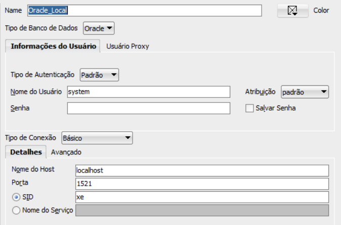
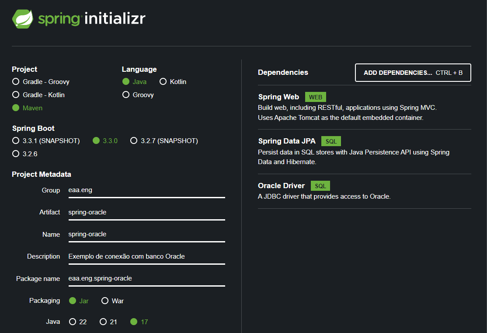

# Conexão Spring Boot com Oracle XE

## Instalando o Oracle Database Express Edition (XE)

Fazer [download](https://www.oracle.com/br/database/technologies/xe-downloads.html) do Oracle XE para o seu sistema operacional 
e seguir o passo a passo da instalação.<br>
Importante anotar a senha utilizada duranto o processo de instalação para os usuários sys, system e pdbadmin. 
Essa senha será necessária posteriormente para conectar ao banco de dados.

## Instalando o SQL Developer

Fazer [download](https://www.oracle.com/database/sqldeveloper/technologies/download/) do Oracle SQL Developer para o seu sistema operacional
e seguir o passo a passo da instalação.

## Preparando o ambiente Oracle

Realizar conexão no banco de dados com o usuário **system** para criar o usuário que será usado no app, conforme imagem abaixo:



```sql
ALTER SESSION SET "_ORACLE_SCRIPT" = TRUE;

CREATE USER USER_APP IDENTIFIED BY <Senha do usuário> DEFAULT TABLESPACE USERS;
GRANT CONNECT, RESOURCE TO USER_APP;
ALTER USER USER_APP QUOTA UNLIMITED ON USERS;
```

Criar uma nova conexão com o usuário USER_APP, e executar o comando abaixo:

```sql
CREATE TABLE CLIENTE (	
    ID NUMBER(5), 
	RAZAO_SOCIAL VARCHAR2(100), 
	CNPJ VARCHAR2(20), 
	SEGMERCADO_ID NUMBER(5), 
	DATA_INCLUSAO DATE, 
	FATURAMENTO_PREVISTO NUMBER(10,2), 
	CATEGORIA VARCHAR2(20),
    CONSTRAINT PK_CLIENTE PRIMARY KEY(ID)
);

INSERT INTO CLIENTE VALUES (1 ,'SUPERMERCADO ABC','12345678/0001-12',1,sysdate,150000, 'GRANDE' );
INSERT INTO CLIENTE VALUES (2 ,'SUPERMERCADO DEF','12345678/0001-12',1,sysdate,90000, 'MEDIO GRANDE' );
INSERT INTO CLIENTE VALUES (3 ,'SUPERMERCADO GHI','12345678/0001-12',1,sysdate,50000, 'MEDIO' );
INSERT INTO CLIENTE VALUES (4 ,'FARMACIA AXZ','12345678/0001-12',3, sysdate,25000,  'PEQUENO' );
COMMIT;
```
## Preparando o Spring Boot

Criar um novo projeto com as seguintes dependências:



Importar o projeto para a IDE da sua preferência.
Após a importação o arquivo pom.xml deverá ter a seguinte dependência:
```xml
<dependency>
    <groupId>com.oracle.database.jdbc</groupId>
    <artifactId>ojdbc11</artifactId>
    <scope>runtime</scope>
</dependency>
```
### Configuração do application.properties

Copiar
```text
# Configuracoes do banco de dados
spring.datasource.url=jdbc:oracle:thin:@localhost:1521:XE
spring.datasource.username=USER_APP
spring.datasource.password=USER_APP

# Configuracoes de JPA
spring.jpa.database-platform=org.hibernate.dialect.OracleDialect
```

### Implementando as classes de controller, entity, service e repository

```java
@RestController
@RequestMapping("/cliente")
public class ClienteController {

    @Autowired
    private ClienteService clienteService;

    @GetMapping()
    public ResponseEntity<List<Cliente>> findAll (){
        List<Cliente> clientes = clienteService.findAll();
        return ResponseEntity.ok(clientes);
    }

    @PostMapping()
    public ResponseEntity<Cliente> save (@RequestBody Cliente cliente) {
        Cliente clienteNovo = clienteService.save(cliente);
        return ResponseEntity.ok(clienteNovo);
    }
}

@Entity
@Table(name = "CLIENTE")
public class Cliente {

    @Id
    @Column(name = "ID")
    private Integer id;

    @Column(name = "RAZAO_SOCIAL")
    private String razaoSocial;

    @Column(name = "CNPJ")
    private String cnpj;

    @Column(name = "SEGMERCADO_ID")
    private String segmercadoId;

    @Column(name = "DATA_INCLUSAO")
    private LocalDate dataInclusao;

    @Column(name = "FATURAMENTO_PREVISTO")
    private BigDecimal faturamentoPrevisto;

    @Column(name = "CATEGORIA")
    private String categoria;

    //Adicionar construtores, getters e setters

}

@Service
public class ClienteService {

    @Autowired
    private ClienteRepository clienteRepository;

    public Cliente save (Cliente cliente) {
        return clienteRepository.save(cliente);
    }

    public List<Cliente> findAll() {
        return clienteRepository.findAll();
    }
}

@Repository
public interface ClienteRepository extends JpaRepository<Cliente, Integer> {

}
```


